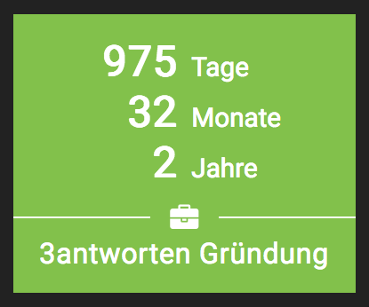

# Timecount widget

## config options:

- seconds
- minutes
- hours
- days
- months
- years
- decades

- icon
- title

## render example

You have to supply the widget ID, configured in the `timecount.yml`. For example:

`= render 'widgets/timecount',
         widget_id: 'exampleTimecount'`
